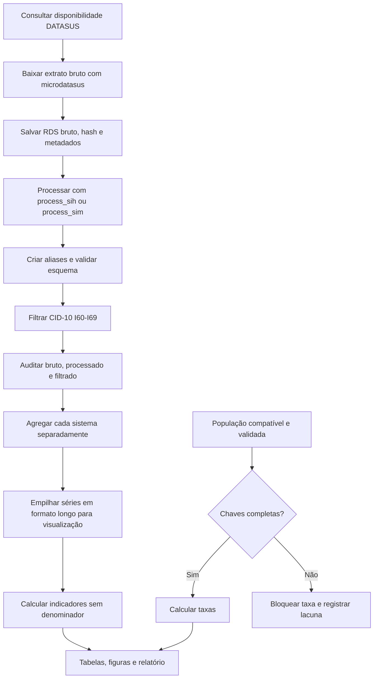

# Fluxo de processamento

SIH e SIM são fontes independentes. Não há pareamento, junção ou correlação entre
registros ou agregados dos dois sistemas. Quando aparecem na mesma tabela longa
ou figura, as séries são apenas empilhadas e identificadas pelo campo `sistema`.
